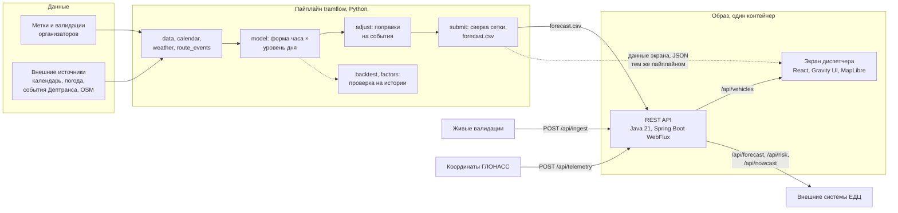

# Прогноз посадок на трамвайных маршрутах Москвы

Сервис прогнозирует число посадок на десяти трамвайных маршрутах по часам,
отдаёт прогноз через REST API и показывает его на дашборде диспетчера
с картой, мнемосхемой и поправками на погоду и события.

Прогнозный период задачи — ноябрь и декабрь 2025 года, обучающий —
январь—октябрь 2025 (`train.csv` — январь—август, `test.csv` — сентябрь—октябрь).
Целевая величина — число успешных валидаций на маршруте за календарный час;
способ оплаты и тип билета роли не играют.

**Результат на лидерборде: WAPE-score 0,90715** по полной сетке маршрут × дата × час
(14 640 строк, пустой час считается нулём). Метрика — `1 − WAPE`, код в
[tramflow/metrics.py](tramflow/metrics.py).

## Как проверить

Нужен только Docker. Из корня репозитория:

```sh
docker compose up
```

Экран диспетчера — http://localhost:8080/, вход `jury` / `tramflow`; методы API — на том же
адресе, список в [api/README.md](api/README.md). Интернет не нужен.

Итоговый прогноз, доли остановок, архив внешних данных и готовый образ файлом лежат
в [релизе v1.0](https://github.com/a-amik/mttech/releases/tag/v1.0). Образ без сборки
и без реестра: `docker load -i tramflow-1.0-amd64.tar.gz`, затем `docker compose up`.

```sh
curl -u jury:tramflow "http://localhost:8080/api/forecast?routes=7&from=2025-12-01&to=2025-12-01"
curl -u jury:tramflow "http://localhost:8080/api/risk?capacity=1500"
curl -u jury:tramflow "http://localhost:8080/api/nowcast?route=7&date=2025-12-01&fact=6:120,7:340,8:410"
curl -u jury:tramflow "http://localhost:8080/api/stops?route=17&date=2025-12-01&hour=8"
```

## Как устроено

| Каталог | Что внутри |
|---|---|
| `tramflow/` | пайплайн целиком: приём меток и валидаций, календарь, погода, события маршрутов, профиль, поправки, сборка и проверка `submission.csv` |
| `api/` | публичный REST API на Java 21 и Spring Boot: отдаёт предрасчитанный прогноз и считает поправки |
| `web/` | дашборд на React и Gravity UI; устройство и правила правок — [FRONTEND.md](FRONTEND.md) |
| `data/` | данные организаторов и внешние источники; в репозитории — только небольшие файлы, нужные для сборки прогноза и долей остановок |
| `artifacts/` | журнал попыток, проверки, выгрузки, в репозиторий не входят |

Цепочка одна и та же и в пайплайне, и в сервисе: **приём → признаки → прогноз →
API → фронт**. Прогноз считается заранее и кладётся файлом; API его только выбирает
и умножает на поправки, поэтому ответ не зависит от тяжёлых расчётов. Экран диспетчера
берёт прогноз из файлов, собранных тем же пайплайном (базовые значения совпадают с API
во всех 14 640 точках), а поправки ползунками считает в браузере, чтобы пересчёт был
мгновенным; положение вагонов он получает из API. Перевод экрана целиком на API —
задача пилота.



### Модель

Ядро — профиль посадок: **форма часа** (доля часа в дневной сумме) умножается
на **уровень дня** (дневная сумма). Так распадается сама природа спроса: форму
задаёт расписание и режим города, уровень — сезон, погода и календарь.

- Форма снимается с пула дней одного типа: понедельник—четверг, пятница, суббота,
  воскресенье. У одного дня недели за месяц четыре наблюдения на час, у пула
  будней — шестнадцать. Это допущение: будни одного типа считаются похожими
  по форме, а проверяется оно протоколом ниже.
- Форма последних четырёх недель смешивается с зимней формой января—февраля:
  60 % осенней, 40 % зимней (`winter_weight` — доля осенней формы). Зимой светает
  позже, вечер темнеет раньше, и посадки сдвигаются по часам. Вечерний спад
  привязан к закату.
- Уровень дня — взвешенная медиана по часам (`L1`) с поправкой на слабый тренд
  (наклон Тейла—Сена по восьми неделям) и сглаживанием дня недели через тип дня.
- Отношение выходного к будню тянется к зимнему по мере окна: 0,15 в начале
  ноября, 0,5 к концу декабря.
- Праздник в будний день считается по воскресной форме, рабочая суббота — по
  пятничной, сокращённый день — по своему дню недели.
- Поверх — поправки на подтверждённые события: восстановление выходных маршрутов
  7 и 50 после ремонта с 15 ноября, открытие маршрута 5 с 16 декабря, укорочение
  7 и 50 после 23:00 с 13 декабря и отток с маршрута 7 на диаметр Т1 с 12 ноября.
  Отток посчитан по источникам, а не подобран: доля общих с Т1 остановок (20 %) ×
  доля Т1 в частоте на общем участке (0,625) × половина поездок, идущих вдоль общего
  участка, — 6,25 %, с нарастанием вслед за пассажиропотоком Т1 из постов Дептранса.
  Уровень маршрута 5 — около 83 тысяч посадок за окно, по ответу организаторов о его
  доле в эталонной сетке.
- Особые дни окна: 1 ноября × 0,875, 29—30 декабря × 0,935, вечер 31 декабря
  с 18:00 × 0,5, снегопад 26 декабря × 1,03. Их коэффициенты подобраны на конкурсной
  сетке — это калибровка по лидерборду, а не оценка по истории: в истории таких
  дней нет. Снегопад дал +0,00006 (v19 → v24) — в пределах шума; поправка осталась
  в цепочке v54, но погодным фактором с доказанным эффектом мы её не считаем.

**Что оценено по данным, а что выбрано.**

| Параметр | Как получен |
|---|---|
| Форма часа по маршруту и типу дня | средняя доля часа за последние четыре недели и за январь—февраль |
| Уровень дня | взвешенная медиана «факт часа / доля часа» — минимум суммы абсолютных ошибок при фиксированной форме |
| Тренд | наклон Тейла—Сена по восьми неделям |
| Вес формы 0,6, тренд 0,25, сглаживание 0,5 | протокол на восьми месячных и четырёх двухмесячных окнах |
| Выходные к зиме 0,15 → 0,5, закат 0,05 | лидерборд |
| Особые дни и снегопад | лидерборд |
| События маршрутов и маршрут 5 | даты и цифры из постов Дептранса, эффект подтверждён лидербордом |

Вся композиция — не единый оптимум: после взвешенной медианы идут сглаживание,
тренд и блоки поправок. Порог высшего балла модель проходит и без калибровки
по лидерборду: первая попытка, профиль четырёх недель, дала 0,88386.

**Проверка на истории.** Ядро v41, общее с итоговой v54, — форма, уровень, тренд, зимние выходные — без
датированных поправок ноября—декабря, которые на прошлые месяцы не переносятся.
Обучение до конца месяца, прогноз следующего; база — профиль четырёх недель с той
же зимней смесью 50/50:

| Окно | 03 | 04 | 05 | 06 | 07 | 08 | 09 | 10 | Объединённо |
|---|---|---|---|---|---|---|---|---|---|
| База | 0,9133 | 0,8319 | 0,8345 | 0,8633 | 0,7919 | 0,8487 | 0,8140 | 0,9095 | 0,85292 |
| Ядро v41 | 0,9160 | 0,8343 | 0,8579 | 0,8703 | 0,8038 | 0,8439 | 0,8140 | 0,9129 | 0,85861 |

Ядро лучше базы в шести окнах из восьми, в сентябре вровень, в августе хуже
на 0,005; на двухмесячных окнах лучше во всех четырёх. Прибавка на октябре +0,0033,
95 % по неделям — от +0,0007 до +0,0065. Разрез октября:

| Срез | WAPE-score | Смещение суммы |
|---|---|---|
| Утренний пик, 7—10 | 0,9256 | −0,3 % |
| Вечерний пик, 17—20 | 0,9157 | +1,1 % |
| Лучший маршрут — 17 | 0,9423 | −2,2 % |
| Худший маршрут — 25 | 0,8417 | −10,8 % |
| Вся сетка | 0,9129 | −0,5 % |

Воспроизводится одной командой: `python -m tramflow.protocol v41_wratio_ramp05`.

**Что проверили и отвергли.** Градиентный бустинг с пуассоновской потерей на тех же
окнах дал на октябре те же 0,90. Смесь профиля с бустингом выигрывала +0,0066
на объединённых окнах только за счёт признака «день года»: без него выигрыш исчезает,
а на окне «октябрь по сентябрю» все варианты с бустингом хуже профиля на 0,004—0,005.
При десяти месяцах истории без прошлого ноября деревья учат лето. Не подтвердились
и ранние поправки на Т1 по подбору, подвоз к нему, дождь и ледяной дождь, фильтр
выпуска, якорь по пассажиропотоку города.

Прогноз округляется до целого. Сетка ключей сверяется с образцом организаторов
перед каждой загрузкой, отрицательных и пустых значений в файле быть не может
([tramflow/submit.py](tramflow/submit.py)).

### Запуск

Нужны Python 3.12 и архив организаторов `dataset.zip`. Для сборки прогноза достаточно
почасовых меток и образца сетки — сырые `train.csv` и `test.csv` (10 ГБ) распаковывать
не обязательно:

```sh
python -m venv .venv && . .venv/bin/activate
pip install -r requirements.txt
unzip dataset.zip README.md 'labels/*' test_submission.csv -d data/raw

python -m tramflow.submit v54_t1_sources      # собрать submission.csv
python -m tramflow.backtest                   # проверка на октябре и июне
python -m tramflow.factors                    # проверка внешних факторов на истории
cd web && npm install && npm run dev          # дашборд
```

Файл прогноза появляется в `artifacts/submissions/` и совпадает с загруженным
на лидерборд байт в байт. Проверка ядра на всех окнах истории с разрезом по маршрутам
и пикам — `python -m tramflow.protocol v41_wratio_ramp05` (ядро итоговой версии
без датированных поправок окна). Внешние данные, от которых он зависит, лежат
в `data/external/`: производственный календарь (`isdayoff_2025.csv`) и сводная
таблица по дням (`features_daily_2025.csv`) — погода, календарь, события маршрутов
из источников раздела «Внешние источники». Интернет для сборки не нужен.

### Сервис

Публичный API — Java 21 и Spring Boot 4 на WebFlux, методы и параметры в [api/README.md](api/README.md).
Прогноз лежит в памяти целиком, запрос только выбирает срез и умножает его на поправки:

Образ решения собирается из корня репозитория и содержит и сервис, и экран
диспетчера — они отвечают на одном порту:

```sh
docker build -t tramflow . && docker run --rm -p 8080:8080 \
  -e API_USER=dispatcher -e API_PASSWORD=<пароль> \
  -e INGEST_USER=ingest -e INGEST_PASSWORD=<пароль приёма> tramflow
```

Экран открывается на `http://localhost:8080/`, методы API — на том же адресе.
Для жюри образ собирается под linux/amd64:

```sh
docker buildx build --platform linux/amd64 -t tramflow:amd64 --load .
```

Интернет при запуске не нужен ни сервису, ни экрану: прогноз, данные экрана
и подложка карты — срез Москвы из OpenStreetMap, 19 МБ — лежат внутри образа.
Проверено запуском с `--network none`. Образ весит 414 МБ.

Образ берёт готовый прогноз из `api/data/forecast.csv` — это итоговая попытка
`v54_t1_sources` — и данные экрана из `web/public/data/`. В репозитории для жюри
оба лежат готовыми; из сырых валидаций данные экрана пересобираются скриптами
`web/scripts/`, порядок — в [FRONTEND.md](FRONTEND.md).

Отдельный образ только с сервисом, без экрана, собирается из `api/Dockerfile`.

**Замеры.** Контейнер 2 vCPU и 2 ГБ, проверки — отдельным контуром в [loadtest/](loadtest/README.md):

| Проверка | Результат |
|---|---|
| Ступени 100 → 2 000 запросов в секунду | p95 от 4,5 до 0,9 мс, ошибок нет; потолок копии — около 2 500 в секунду |
| Приём `test.csv` целиком, 13,4 млн строк | 13,1 с под фоном экрана 300 запросов в секунду, около миллиона строк в секунду; экран в это время — p95 2,7 мс, 0 ошибок. Без фона — 9,4 с |
| Две копии за nginx, одна падает под нагрузкой | 0 ошибок из 27 001 запроса |
| Перебор паролей, 100 в секунду | без защиты экран встаёт (медиана 16 с), с защитой — p95 37 мс |
| Обрыв связи, дубли, опоздания, мусор в выгрузке | пересчёт дня не ломается; провал не тянет множитель вниз |
| Память / старт | 250 МиБ в работе, 500 МиБ на приёме / 1,3 с |

Базовая авторизация сессии не держит, поэтому bcrypt считался на каждый запрос и стоил
55 мс. Успешная пара логин-пароль запоминается на пять минут, и тот же запрос стал
занимать 6 мс; в памяти хранится не пароль, а его SHA-256. Неверные пароли так не кэшируются,
поэтому перед проверкой стоит защита от перебора — подробности в [loadtest/README.md](loadtest/README.md).

### Дашборд

Экран диспетчера: сетка «маршрут × час» с окнами риска, мнемосхема и карта Москвы,
три горизонта (день по часам, месяц по дням, год сценариями), поправки ползунками
с мгновенным пересчётом, выгрузка прогноза в CSV и XLSX.

Всё, что на экране оценка, помечено словом «оценка»: загрузка вагона, влияние
погоды, посадки по остановкам. Отдельно считается **детектор провалов наблюдений** — дни, когда
валидаций почти нет, а спрос никуда не делся. Норма дня — медиана того же дня недели
в ±4 неделях; праздники и ремонтные периоды из счёта исключены, потому что это
настоящий спад, а не молчание оборудования. На экране такой день помечается как
подозрение на неполные данные, решение за диспетчером. В итоговой модели фильтр
по числу вагонов с валидациями (`suspicious_days`) выключен: вариант с ним
на лидерборде дал −0,00002.

### Посадки по остановкам

В валидации нет остановки, зато есть точное время, бортовой номер вагона и номер выхода,
а архив расписания transport.mos.ru на прошедшие даты даёт время прохода каждой остановки
каждым рейсом. На днях, где есть и то и другое, — 13—31 октября 2025 года, 4,1 млн
валидаций — посадка привязывается к остановке ([tramflow/stops.py](tramflow/stops.py)):

1. Валидации одного вагона за день режутся на рейсы по стоянкам на конечных: разрезы
   подбираются так, чтобы длина рейса была близка к плановому ходу. 45 тыс. рейсов,
   медианный — ровно плановый ход, 85 % — в пределах 0,8—1,3 плана.
2. Направления рейсов вагона чередуются, их согласует общая картина посадок маршрута.
3. Момент посадки внутри рейса переводится в остановку по плановому времени хода этого
   часа; посадки у конечной до отправления — первой остановке.
4. Доля остановки в посадках маршрута за час, отдельно для будней и выходных,
   умножается на прогноз «маршрут × час».

Точность привязки — ±1—2 остановки: опоздание от графика её сдвигает. Эталона по
остановкам нет ни у нас, ни у организаторов, поэтому проверка — на устойчивость: доли
первой и второй половины октября совпадают с корреляцией 0,97—0,997.

Главная трудность — направление рейса. Без координат вагона картина посадок и её
зеркало (рейс «туда» принят за рейс «обратно») одинаково согласованы, и выбрать между
ними помогают только якоря на местности: пересадки с других наших маршрутов (карта,
вошедшая в вагон через 1—40 минут после другого нашего трамвая, садится на общей
для них остановке) и утренний выпуск (первые вагоны дня уходят с конечной первого
отправления).

| Маршрут | Направление | Пересадки: на общих остановках / в зеркале | Утренний выпуск | Выдаётся |
|---|---|---|---|---|
| 17 | подтверждено | 0,40 / 0,02 | 0,83 | да |
| 7 | вероятно | 0,35 / 0,27 | 0,69 | да |
| 25 | вероятно | 0,60 / 0,16 | 0,63 | да |
| 28 | вероятно | — | 0,73 | да |
| 50 | вероятно | 0,42 / 0,42 | 0,78 | да |
| 11 | якоря спорят | 0,39 / 0,31 | 0,20 | нет |
| 1, 12, 26 | сигнал слаб | — | 0,41—0,57 | нет |
| 5 | истории нет | — | — | нет |

Для маршрутов, где направление не определилось, посадки по остановкам не выдаются:
зеркальная ошибка там больше самой оценки. Экран и API так и отвечают. Надёжно
решить это для всех маршрутов может история координат ГЛОНАСС — её приём в сервисе
уже есть (`POST /api/telemetry`), архива за 2025 год в данных задачи нет.

```sh
python -m tramflow.stops dataset.zip   # выгрузить валидации октября, посчитать доли и отчёт
```

Выборка расписания за октябрь лежит в `data/external/schedule_oct_2025.csv.gz`: архив
портала скользящий, и эти дни из него уже выпадают.

## Внешние источники

Прогнозное окно (1 ноября — 31 декабря 2025) уже прошло, поэтому фактическая
погода и события за него доступны как открытые данные. Посадок наших маршрутов
по часам в этих источниках нет. Цифры о поездках из окна две: 40 тысяч поездок
маршрута 5 за первую неделю из поста Дептранса и пассажиропоток диаметра Т1 по
неделям — они задают уровень нового маршрута и отток с маршрута 7.

| Категория | Источник | Ссылка | Что дал |
|---|---|---|---|
| События маршрутов | «Дептранс. Оперативно» и основной канал Дептранса | [t.me/DtOperativno/23565](https://t.me/DtOperativno/23565), [t.me/DtRoad/55667](https://t.me/DtRoad/55667) | **Около +0,015 к скору** — больше, чем всё остальное вместе. Выходные маршрутов 7 и 50 по образцу до ремонта в Протопоповском переулке: с декабря +0,0072 (0,88707 → 0,89424), с даты восстановления 15 ноября — ещё около +0,007 (до 0,90299, из них +0,0018 — календарные поправки, внесённые той же попыткой); открытие маршрута 5 с 16 декабря, 40 тысяч поездок за первую неделю, +0,0013 |
| Календарь | Производственный календарь | [isdayoff.ru](https://isdayoff.ru) | **Основа уровня дня.** 1 ноября — рабочая суббота, 3—4 ноября и 31 декабря — выходные, 30 декабря — полный рабочий день. Промах по одному такому дню стоит около процента метрики за всё окно. Коэффициенты особых дней подобраны на конкурсной сетке, вместе +0,0018 |
| Погода | Open-Meteo, архив по часам за 2025 год | [open-meteo.com](https://open-meteo.com) | Дождь от 5 мм в будни: на истории января—октября −2,1 % к тому же дню недели, минус во всех шести месяцах, z = −3,2 — связь ретроспективная: коэффициент оценён на той же истории. На окно эффект не переносится: три дождливых будня дали −0,0002, в модель дождь не вошёл |
| Трафик | 2ГИС Distance Matrix, индекс загруженности коридоров по часам | [docs.2gis.com](https://docs.2gis.com/ru/api/navigation/distance-matrix/overview) | **Эффекта нет.** Индекс — типовое время хода по часу недели, архива пробок по дням в API нет. Проверено на истории (`python -m tramflow.traffic_effect`): корреляция отклонения загруженности коридора от сетевой с отклонением формы часа маршрута — будни +0,05, часы пик −0,03, выходные −0,1…−0,25. Сверх часа дня индекс информации не несёт, в прогнозе не используется; на экране остался сценарным ползунком. Источником с подтверждённым эффектом не считаем |
| Пассажиропоток города | Открытые данные Москвы, набор 62521 | [data.mos.ru](https://data.mos.ru) | Помесячные поездки на трамваях: октябрь 2025 — 20,39 млн, ноябрь — 19,34, декабрь — 21,26. Якорь уровня по городу лидерборд отверг (−0,0029): наши десять маршрутов живут не так, как сеть целиком |
| Геометрия сети | OpenStreetMap через Overpass | [overpass-api.de](https://overpass-api.de) | Трассы и 859 остановок десяти маршрутов, пересечения с диаметром Т1; на дашборде — карта и мнемосхема |
| События города | KudaGo, афиши арен, протоколы РПЛ | [kudago.com/public-api](https://kudago.com/public-api/) | 5 409 событий 2025 года с координатами площадок. На истории посадки не двигают: матчи на «РЖД Арене» +0,5 % при z = −0,3 |

Каждая строка этой таблицы проверена на истории 2025 года, а не взята по смыслу.
Мера — день к медиане чистых дней того же дня недели и месяца; фактор считается
состоятельным, если дней не меньше пяти, медиана отходит от единицы дальше 1 %,
знак не меняется ни в одном месяце и |z| ≥ 2 ([tramflow/factors.py](tramflow/factors.py)).
Из погодных факторов этот порог прошёл только дождь. Снег, мороз и гололедица
в обучающем году почти не встречались (два и три дня), поэтому в интерфейсе они
сделаны ползунками с честной подписью «оценка». Единственная снежная поправка
в модели — 26 декабря × 1,03 из калибровки по лидерборду, см. выше: эффект
в пределах шума, и в подтверждённые источники она не входит.

## Область применимости

- **Маршруты.** Модель обучена на девяти маршрутах с историей: 1, 7, 11, 12, 17,
  25, 26, 28, 50. Маршрут 5 открылся 16 декабря 2025 года — у него холодный старт,
  и уровень задан внешней оценкой Дептранса, а не историей.
- **Горизонт.** Проверенный горизонт — два месяца вперёд от конца истории, минимальный
  квант — час. Дневной и месячный разрезы собираются из часов: день равен сумме часов,
  месяц — сумме дней. Годовой горизонт даётся сценариями, а не точным прогнозом:
  десяти месяцев истории для зимы недостаточно.
- **История.** Нужно не меньше восьми недель наблюдений на маршрут, чтобы снять форму
  и уровень; для нового маршрута — либо форма соседнего маршрута со сходной трассой,
  либо внешняя оценка потока.
- **Чего модель не знает.** В обучающем году нет ни одной снежной зимы, поэтому
  переход к зимнему уровню оценён по форме января—февраля и отношению выходных.
  Оборудование иногда молчит: провалы валидаций детектируются и не смешиваются
  со спадом спроса, но восстанавливаются по аналогичным периодам, а не по факту.
- **Перенос на новый маршрут** требует трёх вещей: меток валидаций за восемь недель,
  календаря региона и трассы с остановками. Погода и события подключаются теми же
  скриптами.

## Пределы точности: на что уходит остаток ошибки

Раскладка на октябре, месяце проверки. Модель даёт 0,9129. Если бы уровень каждого
дня был известен заранее, а форма осталась нашей, вышло бы 0,9322. Если бы при
известном уровне была взята лучшая возможная статичная форма — 0,9443.

| Что известно | WAPE-score | Резерв |
|---|---|---|
| Наша модель | 0,9129 | — |
| Точный уровень дня | 0,9322 | +0,019 |
| Точный уровень и лучшая статичная форма | 0,9443 | +0,031 |

Отсюда два вывода. Первый: **крупнейший резерв — уровень дня** (+0,019): сколько
всего людей поедет в конкретный день, модель знает хуже, чем как они распределятся
по часам. Форма поверх точного уровня добавляет ещё +0,012, но без данных зимы
этот резерв не берётся: экстраполяция дрейфа формы, раздельный вес зимы для будней
и выходных, форма по каждому дню недели дали ±0,001 со знаком, гуляющим
по месяцам. Второй: ошибка уровня — это разброс отдельных дней, а не смещение
месяца целиком: общий множитель по пассажиропотоку города метрику только ухудшил
(−0,0029).

Накопление ошибки на 61 день вперёд неизбежно: прогноз строится не по факту
предыдущего дня, которого нет, а по регулярным паттернам, внешним факторам
и собственному предыдущему шагу. Раскладка выше показывает, где именно
накопление живёт: в уровне дня. Поэтому сервис пересчитывает остаток дня
по факту утренних валидаций: на октябре остаток дня по факту до 11:00 — 0,906
против 0,898 без пересчёта ([api/README.md](api/README.md)).

## Пилот и внедрение

Первый этап — теневой пилот в Едином диспетчерском центре на месяц: прогноз
и рекомендации пишутся рядом со сменой, движение по ним не меняется. Прогноз
считается заранее, API только выбирает и пересчитывает, поэтому в эксплуатации
это одна пакетная задача и один контейнер.

**Что меряем.** Ошибку в пиковые часы по каждому маршруту; долю окон риска,
которые подтвердились фактом, и ложные тревоги; сколько рекомендаций диспетчер
принял бы. Экономический эффект считаем после, по стоимости рейса и фактическим
решениям ЕДЦ, — заранее его не обещаем.

**Что нужно до пилота.** Общее хранилище живого факта для нескольких копий
(сейчас принятый факт пишется в журнал на томе `/app/state` и переживает перезапуск,
но копии друг друга не видят), экран прогноза на том же API, журнал решений
диспетчера на сервере, ежедневная сводка ошибки по закрытым часам.

1. **Пересборка прогноза.** Пайплайн `tramflow` собирает прогноз одной командой
   и кладёт файл в образ или в подключённый каталог; сервис читает его при старте.
   Даты окна и реестр событий сейчас задаются в `tramflow/config.py`
   и `tramflow/versions.py` под 2025 год; для пилота они становятся параметрами
   запуска.
2. **Живые валидации.** Выгрузка валидаций подаётся в `POST /api/ingest` в формате
   `train.csv`; по принятому факту первых часов `GET /api/nowcast` пересчитывает
   остаток дня маршрута.
3. **Пилот в смене диспетчера.** Проверяем окна риска и рекомендацию в рейсах
   на живой смене и сверяем прогноз с фактом по каждому маршруту и часу. Когда
   откроют данные ноября—декабря 2025, та же сверка делается и для окна задачи.
4. **Что доработать.** Посадки по остановкам — оценка и выдаются для пяти маршрутов
   из десяти: без координат вагона направление рейса определяется не везде. С архивом
   ГЛОНАСС или валидаторами, пишущими остановку, это закрывается для всех маршрутов,
   а с цепочками поездок по карте — и загрузка на перегонах. Зимнюю форму часа модель уточнит после первой полной зимы в истории.
5. **Перенос.** Контур опирается только на валидации, календарь и трассу, поэтому
   переносится на автобусы и электробусы теми же скриптами.

## Команда

«Лидеры цифровой прокрастинации», трое:

- **Амбарцум Амаякян** — капитан, продукт и модель;
- **Иван Пластун** — разработка и процессы;
- **Ростислав Галкин** — архитектура и фронтенд.

## Библиотеки и данные

Код написан в рамках хакатона, заготовок из других проектов и готовых обученных
моделей в решении нет. Ниже — все открытые библиотеки, инструменты и данные,
которые использованы.

| Компонент | Версия | Лицензия | Где |
|---|---|---|---|
| pandas | 3.0 | BSD-3-Clause | пайплайн прогноза |
| NumPy | 2.5 | BSD-3-Clause | пайплайн прогноза |
| requests | 2.34 | Apache-2.0 | загрузка открытых данных |
| openpyxl | 3.1 | MIT | чтение справочников организаторов |
| Spring Boot (WebFlux, Security, Actuator) | 4.0 | Apache-2.0 | публичный API |
| Eclipse Temurin (OpenJDK) | 21 | GPL-2.0 with Classpath Exception | среда выполнения API в образе |
| React | 19 | MIT | экран диспетчера |
| Gravity UI (`@gravity-ui/uikit`) | 7.50 | MIT | компоненты экрана |
| MapLibre GL JS | 6.11 | BSD-3-Clause | карта |
| PMTiles | 4.5 | BSD-3-Clause | офлайн-подложка карты |
| Zustand | 5.0 | MIT | состояние экрана |
| Golos Text (`@fontsource/golos-text`) | 5.3 | SIL OFL 1.1 | шрифт экрана |
| Vite, Tailwind CSS, TypeScript | 8.3, 4.3, 6.0 | MIT, MIT, Apache-2.0 | сборка экрана |
| k6 | — | AGPL-3.0 | нагрузочные проверки, в образ не входит |
| nginx | — | BSD-2-Clause | балансировщик в контуре проверок, в образ не входит |
| osmium-tool, tippecanoe | — | GPL-3.0, BSD-2-Clause | сборка подложки карты, в образ не входят |

| Данные | Лицензия и условия | Где |
|---|---|---|
| Выгрузка организаторов (`dataset.zip`) | условия Положения о хакатоне | обучение и проверка |
| OpenStreetMap | ODbL 1.0, © участники OpenStreetMap | трассы, остановки, подложка карты |
| Open-Meteo, архив погоды | CC BY 4.0 | погода |
| Производственный календарь isdayoff.ru | открытый API | календарь |
| Открытые данные Москвы, data.mos.ru | условия портала открытых данных | пассажиропоток города |
| Каналы Дептранса в Telegram | открытые публикации, ссылки в разделе «Внешние источники» | события маршрутов |
| KudaGo, 2ГИС | условия открытых API | события города, трафик |

Python-зависимости с точными версиями — в [requirements.txt](requirements.txt),
Java — в [api/pom.xml](api/pom.xml), фронта — в [web/package-lock.json](web/package-lock.json).

## Журнал попыток

Все загрузки на лидерборд ведутся журналом с параметрами, замером на октябре
и июне и полученным скором. Попыток было 40; итоговая — `v54_t1_sources`.
Реестр версий с разбором каждого круга — [tramflow/versions.py](tramflow/versions.py),
журнал скоров — `artifacts/submissions/log.json` (в репозиторий не входит).
